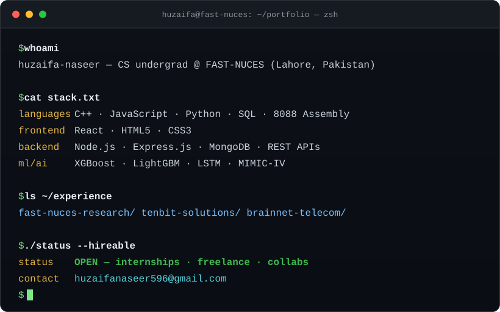

  <a href="#about">about</a> ·
  <a href="#experience">experience</a> ·
  <a href="#projects">projects</a> ·
  <a href="#stack">stack</a> ·
  <a href="#connect">connect</a>

 

 

↓ Choose a section above, or start with <a href="#about">the short version</a>.

 

## `$ cat about.md`

CS undergrad at **FAST-NUCES, Lahore** — I learn by building. I've shipped a **hospital billing system** on the MERN stack, built responsive landing pages at BrainNet Telecom, and I'm currently a **research intern** on **XEL-Sepsis** — an explainable ensemble model (XGBoost · LightGBM · LSTM) for early sepsis prediction on MIMIC-IV ICU data. When I'm not shipping, I'm grinding **DSA in C++**.

  

 

## `$ git log --experience`

<table width="100%">
<tr>
<td width="18%" valign="top"><b>Jul 2026 — Present</b></td>
<td width="27%" valign="top"><b>Research Intern</b> FAST-NUCES</td>
<td width="55%" valign="top">Designing <b>XEL-Sepsis</b>, an explainable ensemble (XGBoost · LightGBM · LSTM) for early sepsis prediction on MIMIC-IV, with a faculty-led team.</td>
</tr>
<tr>
<td valign="top"><b>Jun – Aug 2026</b></td>
<td valign="top"><b>MERN Stack Intern</b> Tenbit Solutions</td>
<td valign="top">Built a hospital billing system — REST APIs, auth flows, database design.</td>
</tr>
<tr>
<td valign="top"><b>Jun – Aug 2025</b></td>
<td valign="top"><b>Frontend Intern</b> BrainNet Telecom</td>
<td valign="top">Shipped multiple responsive, cross-browser landing pages.</td>
</tr>
</table>

 

## `$ ls ~/projects --featured`

<table width="100%">
<tr>
<td width="50%" valign="top">
   
  Explainable early-sepsis prediction on MIMIC-IV ICU data. 
  <code>XGBoost · LightGBM · LSTM</code>
</td>
<td width="50%" valign="top">
   
  A hiring platform where companies post roles and candidates apply. 
  <code>MongoDB · Express · React · Node</code>
</td>
</tr>
<tr>
<td valign="top">
   
  Weekly dengue-case forecasting for Pakistani cities. 
  <code>Python · ML</code>
</td>
<td valign="top">
   
  A real-time, interrupt-driven balloon-popping arcade game. 
  <code>8088 Assembly</code>
</td>
</tr>
<tr>
<td colspan="2" valign="top">
   
  A classic Tetris clone built from the ground up with object-oriented C++.
</td>
</tr>
</table>

<b>▸ Pick a route</b> — here for a quick look, a collaboration, or the technical details?

 

| You are here to… | Best next stop |
|---|---|
| See product work | <a href="https://github.com/huzaifa596/HireAtlas"><b>HireAtlas</b></a> — a full-stack hiring platform |
| Talk research or ML | Read the <a href="#experience">research internship</a> overview, then connect below |
| Check engineering tools | Jump to <a href="#stack">the stack</a> and GitHub activity |
| Start a conversation | <a href="mailto:huzaifanaseer596@gmail.com">Send an email</a> or connect on <a href="https://www.linkedin.com/in/huzaifa-naseer-231728234/">LinkedIn</a> |

▸ more on <a href="https://huzaifaportfolio.site">huzaifaportfolio.site</a> — landing pages, templates & experiments

 

## `$ ls ~/stack`

<b>LANGUAGES</b>
 

  

<b>FRAMEWORKS & DATA</b>
 

  

<b>TOOLS</b>
 

 

## `$ git log --graph --stats`

  
  

  

## `$ git profile --overview`

  

Live contribution activity, commit rhythm, and repository highlights.

 

## `$ ls ~/certs`

  
  
  
  

 

## `$ ping huzaifa`

<b>▸ <code>help --collaborate</code></b>

 

I am especially happy to hear about:

- a full-stack product that needs a thoughtful, reliable builder;
- an ML or data project where clear evaluation matters; or
- an internship, freelance brief, or idea worth turning into something real.

Best first message: what you are building, where you need help, and your ideal timeline.

 

  <b>Choose a channel:</b> email for opportunities · LinkedIn for a professional hello · portfolio for the work

  
  
  
  

 

  <picture>
    <source media="(prefers-color-scheme: dark)" srcset="https://raw.githubusercontent.com/huzaifa596/huzaifa596/gh-pages/snake-dark.svg" />
    
  </picture>

  

<code>$ exit 0</code>

